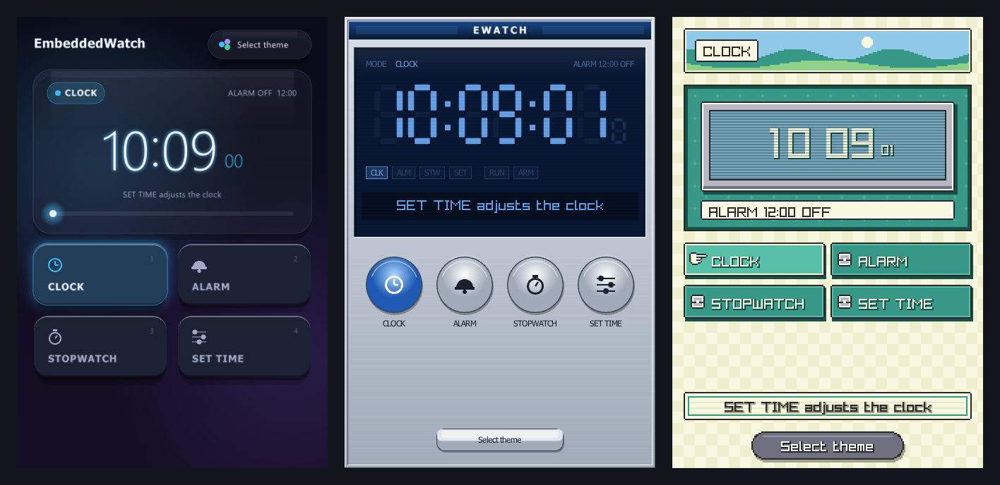
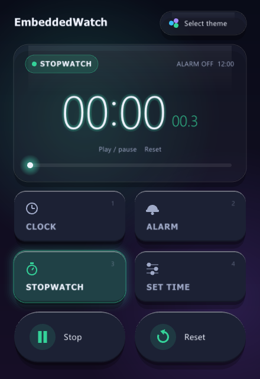
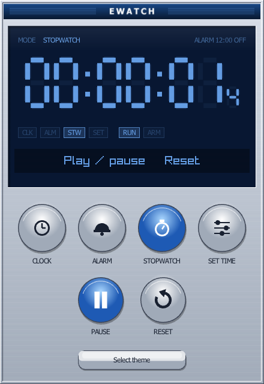
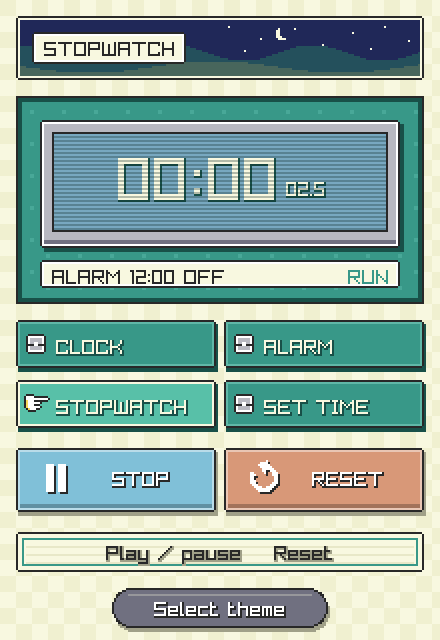
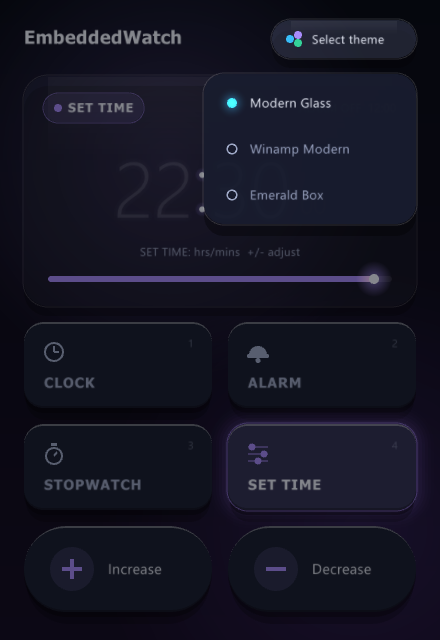

# EmbeddedWatch: a four-mode digital watch as a state machine in C

A portable watch core with a themed desktop front end

A set of cooperating **hierarchical state machines** written in plain C implements the watch logic,
and an optional **raylib** desktop GUI drives it and displays it in one of three interchangeable themes.



The core models the classic digital watch with four modes: Clock, Alarm, Stopwatch and Time-set.
Button presses and 100 ms clock ticks reach it as signals. It uses no dynamic memory allocation and has
no platform dependencies, so it can be embedded on resource-constrained targets. The repository
provides the core logic, a unit test suite and the desktop GUI; it does not include a hardware
integration layer.

### Themes

The **Select theme** button switches the look of the running watch without resetting it.

| | |
|---|---|
|  |  |
| **Modern Glass**: frosted glass display, bento-grid mode tiles and soft buttons that compress when pressed (shown in Stopwatch mode) | **Winamp Modern**: metal frame and blue seven-segment display, with one round button per mode and round play/pause and reset buttons (shown in Stopwatch mode) |
|  |  |
| **Emerald Box**: GBA-style pixel-grid interface drawn at half resolution and upscaled 2×; the banner sky follows the time of day (shown in Stopwatch mode at night) | **Select theme** menu, open over the Modern Glass theme |

## Build & run

```bash
cmake -S . -B build                  # add -DBUILD_GUI=OFF to skip the GUI
cmake --build build
./build/test/run-test                # Catch2 unit tests (core library)
./build/gui/ewatch-gui               # launches the desktop GUI
```

Requires CMake ≥ 3.16 and a C/C++ compiler. Catch2 and raylib 5.5 are fetched by CMake on the first
configure, so that step needs network access. With `-DBUILD_GUI=OFF` only the core library and the tests
are built, and raylib is not fetched.

## Using it

| Control | Key | What it does |
|---|---|---|
| **Clock** | `1` or `C` | Shows the time of day. The clock starts from the system time. |
| **Alarm** | `2` or `A` | Shows the alarm time. Press again (*Set Alarm*) to edit the hours, then the minutes, then arm it; the field being edited blinks. When the alarm rings, open Alarm and press it again to silence it. |
| **Stopwatch** | `3` or `S` | Shows the stopwatch, which keeps running in the background while other modes are open. |
| **Set Time** | `4` or `E` | Edits the clock. Press again to switch between hours and minutes; the field being edited blinks. |
| **+** | `+` or `↑` | Increases the field being edited. In Stopwatch mode it becomes play/pause and starts or stops the stopwatch. Hidden in Clock mode. |
| **−** | `-` or `↓` | Decreases the field being edited. In Stopwatch mode it becomes reset (↺) and resets the stopwatch. Hidden in Clock mode. |
| **Select theme** | `T` | Opens the theme menu; `1`–`3` pick a theme and `Esc` closes the menu. |

A hint line in every theme shows what the buttons do in the current mode.

## Design

Each mode is its own state machine:

| Module | Role |
|---|---|
| `ClockCounter` | Tenths-of-a-second counter with day rollover; the shared primitive behind every timekeeping component. |
| `EWatchClock` | The running time-of-day clock. |
| `EWatchStopwatch` | Start/stop/reset stopwatch. |
| `EWatchTimeset` | Hours/minutes editing, used both to set the clock and to set the alarm time. |
| `EWatchAlarm` | Alarm configuration and expiration, driven by ticks from `EWatchClock`. |
| `EWatch` | Top-level state machine that switches between modes and routes button and tick signals to the active submachine. |

**GUI notes.** The GUI in `gui/` only calls the public `EWatch` API: it sends `EW_CLOCK_TICK_SIG`
ten times a second regardless of the frame rate, and turns clicks and keys into the button signals.
Each theme is one source file that sets its own button layout and draws the screen from a read-only
snapshot of the watch, so adding a theme does not touch the watch logic.

## License

Distributed under the MIT License. See [LICENSE](LICENSE) for details.
